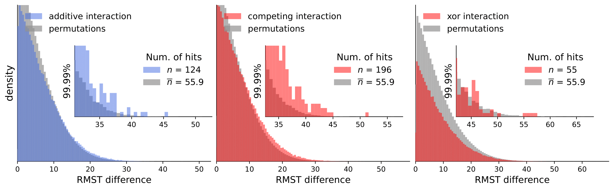
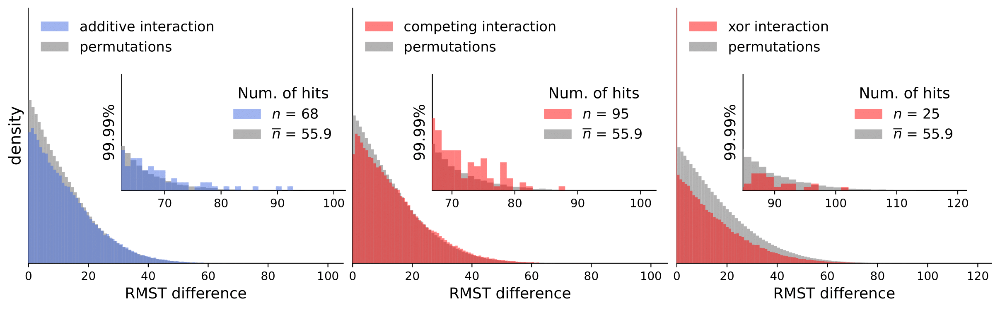
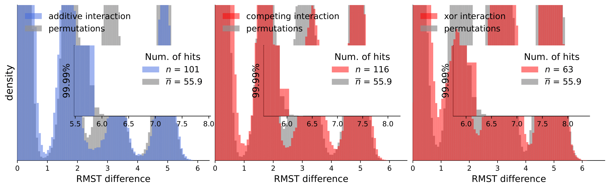

# Discovery Science 2023: Gene Interactions in Survival Data Analysis: A Data-driven Approach Using Restricted Mean Survival Time and Literature Mining

This repository has all the scripts and supporting data we used to analyze and generate the figures. The TCGA datasets are too big to store them here. To reproduce the results, please follow [this guide](https://github.com/biolab/AIME-2023-paper) to download the datasets and store them in the `data` folder.

Scripts for calculating [interactions](calculate_interactions.py) and [permutations](calculate_permutations.py) (note that this takes a considerable amount of time and compute resources).

To analyze our results, they are available in [computed_interactions](computed_interactions). We have a separate .csv containing results for all interaction types for each dataset (note that permutation tests are not included because of the size limit).

[Notebooks](notebooks) folder contains notebooks used to generate the figures and different types of analysis presented in the paper. If you have trouble running the notebooks, feel free to contact us (via email or repository issue tracker).

Finally, the implementation of the method to calculate interactions is located in [method folder.](method)


# Literature summaries for all interactions types across all of the datasets

| Dataset  | Additive (+) | Competing (-) | XOR (*) |
|----------|----------|----------|----------|
| METABRIC | [gpt3-summary](explained_interactions/METABRIC/additive.md) | [gpt3-summary](explained_interactions/METABRIC/competing.md) | [gpt3-summary](explained_interactions/METABRIC/xor.md) |
| BLCA | [gpt3-summary](explained_interactions/BLCA/additive.md) | [gpt3-summary](explained_interactions/BLCA/competing.md) | [gpt3-summary](explained_interactions/BLCA/xor.md) |
| BRCA | [gpt3-summary](explained_interactions/BRCA/additive.md) | [gpt3-summary](explained_interactions/BRCA/competing.md) | [gpt3-summary](explained_interactions/BRCA/xor.md) |
| CESC | [gpt3-summary](explained_interactions/CESC/additive.md) | [gpt3-summary](explained_interactions/CESC/competing.md) | [gpt3-summary](explained_interactions/CESC/xor.md) |
| COAD | [gpt3-summary](explained_interactions/COAD/additive.md) | [gpt3-summary](explained_interactions/COAD/competing.md) | [gpt3-summary](explained_interactions/COAD/xor.md) |
| GBM | [gpt3-summary](explained_interactions/GBM/additive.md) | [gpt3-summary](explained_interactions/GBM/competing.md) | [gpt3-summary](explained_interactions/GBM/xor.md) |
| HNSC | [gpt3-summary](explained_interactions/HNSC/additive.md) | [gpt3-summary](explained_interactions/HNSC/competing.md)</br> [gpt4-summary](explained_interactions/HNSC/competing_gpt-4.md) | [gpt3-summary](explained_interactions/HNSC/xor.md) |
| KIRC | [gpt3-summary](explained_interactions/KIRC/additive.md) | [gpt3-summary](explained_interactions/KIRC/competing.md) </br> [gpt4-summary](explained_interactions/KIRC/competing_gpt-4.md)| [gpt3-summary](explained_interactions/KIRC/xor.md) |
| KIRP | [gpt3-summary](explained_interactions/KIRP/additive.md) | [gpt3-summary](explained_interactions/KIRP/competing.md) | [gpt3-summary](explained_interactions/KIRP/xor.md) |
| LAML | [gpt3-summary](explained_interactions/LAML/additive.md) | [gpt3-summary](explained_interactions/LAML/competing.md) | [gpt3-summary](explained_interactions/LAML/xor.md) |
| LGG | [gpt3-summary](explained_interactions/LGG/additive.md) | [gpt3-summary](explained_interactions/LGG/competing.md) | [gpt3-summary](explained_interactions/LGG/xor.md) |
| LIHC | [gpt3-summary](explained_interactions/LIHC/additive.md) | [gpt3-summary](explained_interactions/LIHC/competing.md) | [gpt3-summary](explained_interactions/LIHC/xor.md) |
| LUAD | [gpt3-summary](explained_interactions/LUAD/additive.md) | [gpt3-summary](explained_interactions/LUAD/competing.md) | [gpt3-summary](explained_interactions/LUAD/xor.md) |
| LUSC | [gpt3-summary](explained_interactions/LUSC/additive.md) | [gpt3-summary](explained_interactions/LUSC/competing.md) | [gpt3-summary](explained_interactions/LUSC/xor.md) |
| OV | [gpt3-summary](explained_interactions/OV/additive.md) | [gpt3-summary](explained_interactions/OV/competing.md) | [gpt3-summary](explained_interactions/OV/xor.md) |
| PRAD | [gpt3-summary](explained_interactions/PRAD/additive.md) | [gpt3-summary](explained_interactions/PRAD/competing.md) | [gpt3-summary](explained_interactions/PRAD/xor.md) |
| READ | [gpt3-summary](explained_interactions/READ/additive.md) | [gpt3-summary](explained_interactions/READ/competing.md) | [gpt3-summary](explained_interactions/READ/xor.md) |
| SKCM | [gpt3-summary](explained_interactions/SKCM/additive.md) | [gpt3-summary](explained_interactions/SKCM/competing.md) | [gpt3-summary](explained_interactions/SKCM/xor.md) |
| STAD | [gpt3-summary](explained_interactions/STAD/additive.md) | [gpt3-summary](explained_interactions/STAD/competing.md) | [gpt3-summary](explained_interactions/STAD/xor.md) |
| THCA | [gpt3-summary](explained_interactions/THCA/additive.md) | [gpt3-summary](explained_interactions/THCA/competing.md) | [gpt3-summary](explained_interactions/THCA/xor.md) |
| UCEC | [gpt3-summary](explained_interactions/UCEC/additive.md) | [gpt3-summary](explained_interactions/UCEC/competing.md) | [gpt3-summary](explained_interactions/UCEC/xor.md) |

*We used the following prompt:*

```
You are a helpful domain expert with a background in biology. You know the biology of each genes known in the literature. 

Cancer type: TCGA-{cancer_type}
Genes: {gene1} and {gene2}. 

BioGRID protein interaction network; shortest path between {gene1} and {gene2}: {paths} .

Context: {context}

Based on what you know about these two genes and provided context. Describe briefly what specifically these genes do. 
Can you reason about any possible functional associations between these two genes in specific biological terms? 
Use context and your knowledge about biology to answer the question. Be specific in the processes where these genes are involved.

Be concise. Answer in 2-3 short sentences. Start with possible functional associations. 

"""
```

# Permutation test results


### [Permutation tests for BLCA](figures/permutations/BLCA_permutation_tests.pdf)


</br>
</br>

### [Permutation tests for BRCA](figures/permutations/BRCA_permutation_tests.pdf)



</br>
</br>

### [Permutation tests for CESC](figures/permutations/CESC_permutation_tests.pdf)


</br>
</br>

### [Permutation tests for COAD](figures/permutations/COAD_permutation_tests.pdf)


</br>
</br>

### [Permutation tests for GBM](figures/permutations/GBM_permutation_tests.pdf)


</br>
</br>

### [Permutation tests for HNSC](figures/permutations/HNSC_permutation_tests.pdf)


</br>
</br>

### [Permutation tests for KIRC](figures/permutations/KIRC_permutation_tests.pdf)


</br>
</br>

### [Permutation tests for KIRP](figures/permutations/KIRP_permutation_tests.pdf)



</br>
</br>

### [Permutation tests for LAML](figures/permutations/LAML_permutation_tests.pdf)


</br>
</br>

### [Permutation tests for LGG](figures/permutations/LGG_permutation_tests.pdf)


</br>
</br>

### [Permutation tests for LIHC](figures/permutations/LIHC_permutation_tests.pdf)


</br>
</br>

### [Permutation tests for LUAD](figures/permutations/LUAD_permutation_tests.pdf)


</br>
</br>

### [Permutation tests for LUSC](figures/permutations/LUSC_permutation_tests.pdf)


</br>
</br>

### [Permutation tests for OV](figures/permutations/OV_permutation_tests.pdf)


</br>
</br>

### [Permutation tests for PRAD](figures/permutations/PRAD_permutation_tests.pdf)


</br>
</br>

### [Permutation tests for READ](figures/permutations/READ_permutation_tests.pdf)


</br>
</br>

### [Permutation tests for SKCM](figures/permutations/SKCM_permutation_tests.pdf)


</br>
</br>

### [Permutation tests for STAD](figures/permutations/STAD_permutation_tests.pdf)


</br>
</br>

### [Permutation tests for THCA](figures/permutations/THCA_permutation_tests.pdf)



</br>
</br>

### [Permutation tests for UCEC](figures/permutations/UCEC_permutation_tests.pdf)


</br>
</br>

### [Permutation tests for METABRIC](figures/permutations/METABRIC_permutation_tests.pdf)


</br>
</br>